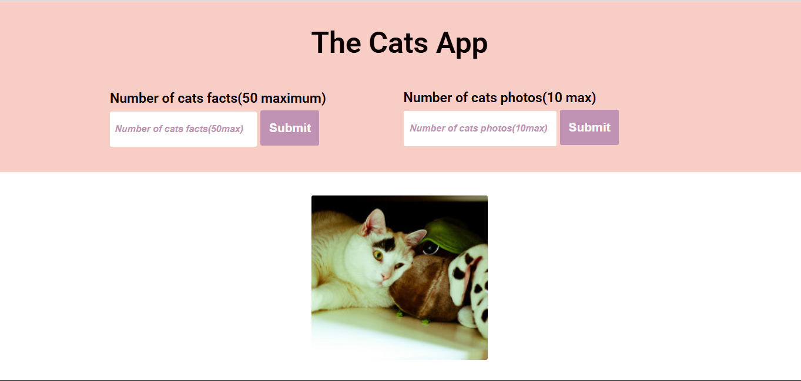

# 🐱 Cats App – Fun Facts & Adorable Photos. 

  

*A simple web app that fetches random cat facts and images to bring joy to cat lovers.*  

---

## 📌 About the Project  
The **Cats App** is designed for all feline enthusiasts. This app allows users to fetch **random cat facts** and **adorable cat images** using external APIs. Whether you're a cat owner, an animal lover, or just in need of a smile, this app delivers fun and cuteness in an instant.  

---

## 🎯 Features  
✅ Fetches **random cat facts** 🐾  
✅ Displays **adorable cat images** 📸  
✅ **Loading Spinner** for a smooth user experience ⏳  
✅ **Error Handling** for failed API requests  
✅ **Responsive UI** for different screen sizes 📱💻  

---

## 🚀 How It Works  
### Fetching Cat Facts  
```javascript
async function fetchCatFacts(limit) {
    showSpinner();  
    try {
        const response = await fetch(`https://meowfacts.herokuapp.com/?count=${limit}`);
        const data = await response.json();
        return data.data; 
    } catch (error) {
        console.error("Error fetching cat facts:", error);
        showError("There was an error fetching cat facts. Please try again later.");
        return []; 
    } finally {
        hideSpinner();  
    }
}
```

## 🎨 Future Improvements
🔹 Dark Mode for a better user experience at night 🌙
🔹 Save Favorite Facts/Images feature ❤️
🔹 Social Sharing to spread the cat love on social media

## 🏆 Why You'll Love This App
Instant Joy – Get a fun cat fact or a cute cat image with just one click

Simple & Fast – No unnecessary clutter, just what you need.

Great for Cat Lovers – Learn something new about your furry friends every time.

🐾 Enjoy exploring the wonderful world of cats. 🐾
